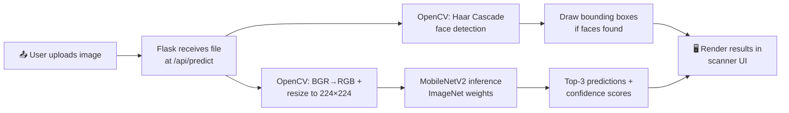

<div align="center">


<br/>

[](https://www.python.org/)
[](https://flask.palletsprojects.com/)
[](https://www.tensorflow.org/)
[](https://opencv.org/)
[](#-license)

[](https://github.com/deepanshu-bisht-dev/Image-Recognition-System/stargazers)
[](https://github.com/deepanshu-bisht-dev/Image-Recognition-System/network/members)
[](https://github.com/deepanshu-bisht-dev/Image-Recognition-System/commits/main)

**⭐ If this project catches your eye, drop it a star — it genuinely helps! ⭐**

</div>

<br/>

## 👁️ What is VISION?

**VISION** is an AI-powered web app that identifies what's inside any image — in real time. Drop in a photo, and within a second it classifies the object across **1,000 categories**, detects human faces with bounding boxes, and shows a **ranked, confidence-scored breakdown** — all wrapped in a custom-built, machine-vision-themed scanner UI (no UI framework, built from scratch).

Built during my **Python Developer Internship at Codec Technologies.**

<br/>

## 📋 Table of Contents

- [✨ Features](#-features)
- [🎬 Demo](#-demo)
- [🛠️ Tech Stack](#️-tech-stack)
- [📂 Project Structure](#-project-structure)
- [⚙️ Getting Started](#️-getting-started)
- [📌 How It Works](#-how-it-works)
- [📈 Roadmap](#-roadmap)
- [🤝 Connect](#-connect)

<br/>

## ✨ Features

| | |
|---|---|
| ⚡ **Real-time classification** | Upload any image, get predictions in under a second |
| 🏆 **Top-3 ranked predictions** | Not just one guess — a full confidence-scored breakdown |
| 🧠 **1000 object classes** | Powered by MobileNetV2 trained on ImageNet |
| 🙂 **Human face detection** | Dedicated OpenCV Haar Cascade pipeline draws bounding boxes around faces |
| 🎨 **Custom machine-vision UI** | Drag-and-drop scanner with animated scan-line + reticle overlay, built from scratch |
| 🔧 **Robust CV pipeline** | Proper decoding, BGR→RGB conversion, and resizing before inference |

<br/>

## 🎬 Demo

> 📸 **Add your own screenshots here.** Create an `assets/` folder in the repo, drop in 2-3 screenshots (upload screen, scan animation, results panel), then reference them like this:
> ```markdown
> 
> ```
> This renders 100% reliably since the image lives inside your own repo — no third-party service involved.

<br/>

## 🛠️ Tech Stack

<div align="center">


</div>

| Layer | Technology |
|---|---|
| **Backend** | Python, Flask |
| **Model** | TensorFlow / Keras — MobileNetV2 (ImageNet weights) |
| **Image Processing** | OpenCV (preprocessing + Haar Cascade face detection) |
| **Frontend** | HTML, CSS, vanilla JavaScript — no framework |

<br/>

## 📂 Project Structure

```
image-recognition-app/
├── app.py                    # Flask app & prediction API
├── model/
│   └── classifier.py          # MobileNetV2 loading + inference
├── utils/
│   ├── image_utils.py          # OpenCV preprocessing
│   └── face_detector.py        # OpenCV Haar Cascade face detection
├── templates/
│   └── index.html              # Scanner UI
├── static/
│   ├── css/style.css           # Machine-vision styling
│   └── js/upload.js            # Drag-drop, preview, results rendering
├── requirements.txt
└── README.md
```

<br/>

## ⚙️ Getting Started

```bash
# 1. Clone the repo
git clone https://github.com/deepanshu-bisht-dev/Image-Recognition-System.git
cd Image-Recognition-System

# 2. Create a virtual environment (Python 3.12 recommended)
python -m venv venv
source venv/bin/activate        # Windows: venv\Scripts\activate

# 3. Install dependencies
pip install -r requirements.txt

# 4. Run the app
python app.py
```

Then open **`http://localhost:5001`** in your browser. MobileNetV2 weights (~14MB) download automatically on first run.

<br/>

## 📌 How It Works



1. User drags/drops or selects an image in the scanner UI
2. Image is sent to `/api/predict` as multipart form data
3. OpenCV runs Haar Cascade face detection on the image
4. In parallel, OpenCV converts BGR → RGB and resizes the image to 224×224
5. MobileNetV2 (pretrained on ImageNet) runs inference on the preprocessed array
6. If faces are detected, bounding boxes are drawn and a "Human Face Detected" result is added to the top
7. Top predictions with confidence scores render as animated confidence bars

<br/>

## 📈 Roadmap

- [ ] Fine-tune on a custom dataset for domain-specific classification
- [ ] Webcam-based live classification
- [ ] Batch upload support
- [ ] Deploy a live demo link

<br/>

## 🤝 Connect

<div align="center">

Built by **Deepanshu Bisht** as part of the Python Developer Internship at Codec Technologies.

[](https://linkedin.com/in/deepanshu-bisht-853731379)
[](https://github.com/deepanshu-bisht-dev)
[](https://instagram.com/deepanshu___25/)

**If VISION impressed you, a ⭐ on this repo goes a long way — thank you!**

</div>


